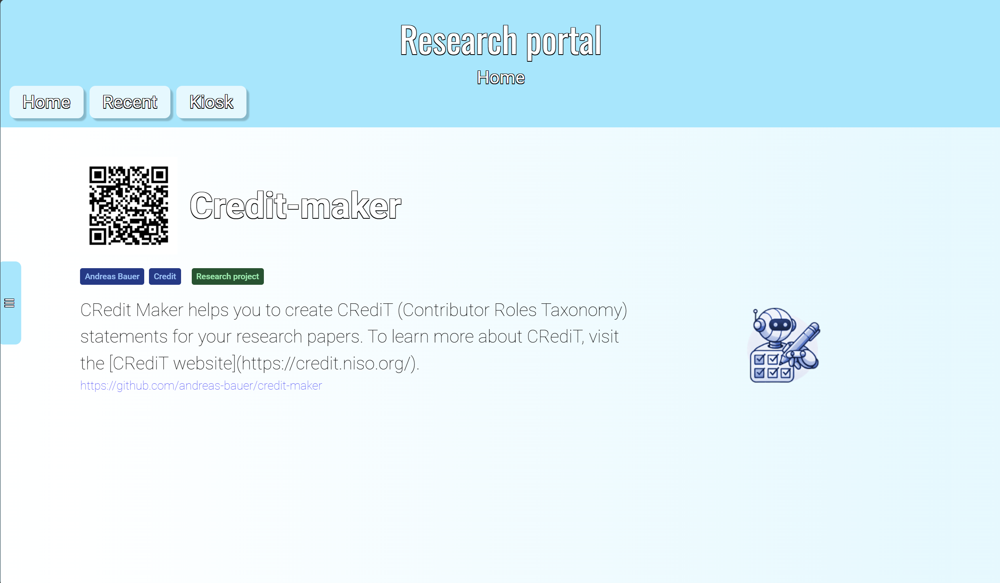

# Research Portal

Research Portal is an application which allows you to add and browse projects which then can be displayed in a general website formate or a tv/kiosk formate designed to auto browse though projects.

# How to Use
To install and use the project simply download it and start it with "npm install" and "npm run dev"

# Build
To build the project use npm run build

# Test
To run unit tests simply type npm run test

# Run
npm run dev and go to http://localhost:3000/

# License
Copyright © 2024 Adam Grimmehed. All rights reserved.

